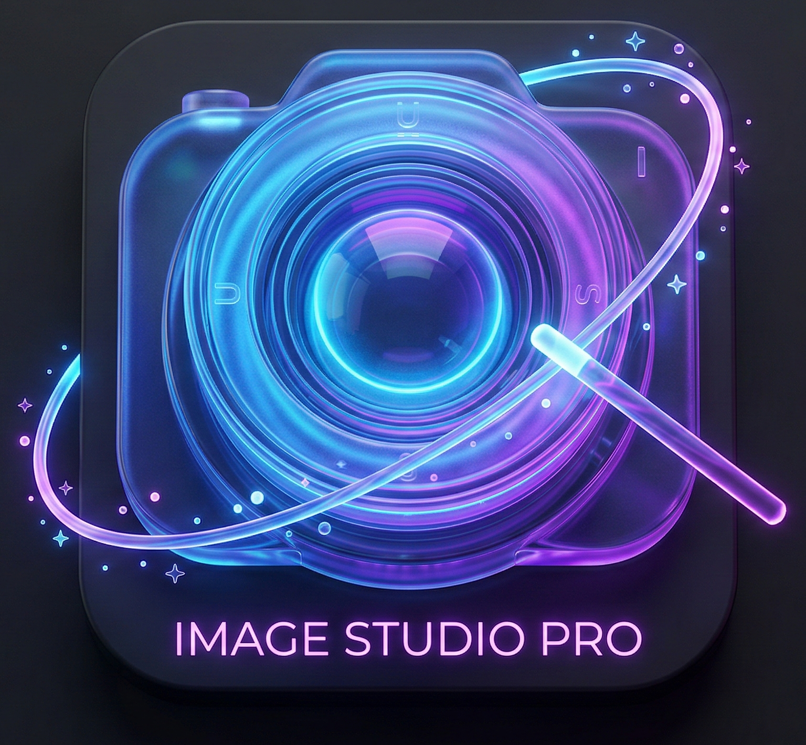

<div align="center">
  

  # Ultimate Image Studio

  A modern Windows desktop app for **format conversion**, **resizing**, and
  **ImageOptim‑style web optimization** — powered by ImageMagick and best‑in‑class
  encoders (MozJPEG, cwebp, pngquant, oxipng), with optional AI background removal.
</div>

---

## ✨ Features

- **🔄 Format Conversion** — convert between PNG, WebP, JPG/JPEG, AVIF, HEIC/HEIF, JXL, ICO, BMP, SVG and more. The output file name carries the image height (e.g. `photo_1080px.webp`).
- **📐 Image Resizing** — resize with aspect‑ratio lock and selectable filters (Lanczos, Mitchell, Point) for sharp downscales or smooth upscales.
- **🌍 Web Optimize (ImageOptim‑style)** — automatically routes each format through the best encoder for the smallest size at the same visual quality:
  | Format | Encoder | Notes |
  |--------|---------|-------|
  | JPG/JPEG | **MozJPEG** (`cjpeg`) | trellis quantization + progressive |
  | WebP | **Google cwebp** | method 6 + sharp YUV |
  | PNG | **pngquant** → **oxipng** | visually‑lossless palette; falls back to true‑lossless |
  | AVIF / others | **ImageMagick** | strips metadata + web flags |

  Metadata (EXIF/GPS) is stripped, and every job logs the size reduction
  (e.g. `📦 5.6 MB → 512 KB (💾 91% smaller)`). If a tool isn't installed, the app
  falls back to ImageMagick automatically — it never breaks.
- **🪄 AI Background Removal** *(optional)* — one‑click subject cut‑out to a transparent PNG using the U²‑Net model (via `rembg`).

## 📦 Requirements

**1. Python packages**
```bash
pip install -r requirements.txt
```

**2. External command‑line tools** (the app calls these via `PATH`)

| Tool | Used for | Required? |
|------|----------|-----------|
| `magick` (ImageMagick) | core conversion/resizing & fallback | **Yes** |
| `cjpeg` (MozJPEG) | best JPEG | optional, for Web Optimize |
| `cwebp` (libwebp) | best WebP | optional, for Web Optimize |
| `pngquant`, `oxipng` | best PNG | optional, for Web Optimize |

The easiest way to install all of them on Windows is [Scoop](https://scoop.sh):

```powershell
scoop install imagemagick mozjpeg libwebp pngquant oxipng
```

> Without the optional encoders the app still works — it just uses ImageMagick
> for those formats instead of the specialized encoders.

## ▶️ Run from source

```bash
python ImageStudio.py
```

## 🏗️ Build a portable .exe

A ready‑made script is included — just double‑click or run:

```bat
build_exe.bat
```

It creates a virtual environment, installs the dependencies, and produces a
single‑file executable at **`dist\UltimateImageStudio.exe`**.

Or run PyInstaller manually:

```bat
pyinstaller --noconfirm --noconsole --onefile ^
  --name "UltimateImageStudio" ^
  --icon "icon.ico" ^
  --add-data "icon.ico;." ^
  --collect-all customtkinter ^
  --collect-all rembg ^
  --collect-all onnxruntime ^
  --collect-all pooch ^
  --collect-all pymatting ^
  ImageStudio.py
```

**Lite build (no AI, much smaller exe):**

```bat
pyinstaller --noconfirm --noconsole --onefile ^
  --name "UltimateImageStudio" --icon "icon.ico" --add-data "icon.ico;." ^
  --collect-all customtkinter --exclude-module rembg --exclude-module onnxruntime ^
  ImageStudio.py
```

> **Notes**
> - The portable `.exe` still expects ImageMagick (and the optional encoders) on
>   `PATH` at runtime — it bundles the Python app, not the external CLI tools.
> - For the **full AI build**, use **Python 3.12**: `onnxruntime`/`rembg` wheels may
>   not yet be available for the very newest Python releases.

## 🛠️ Tech stack

- [CustomTkinter](https://github.com/TomSchimansky/CustomTkinter) — modern UI
- [Pillow](https://python-pillow.org/) — image metadata / dimensions
- [ImageMagick](https://imagemagick.org/) — conversion & resizing engine
- [MozJPEG](https://github.com/mozilla/mozjpeg), [libwebp](https://developers.google.com/speed/webp), [pngquant](https://pngquant.org/), [oxipng](https://github.com/shssoichiro/oxipng) — web optimization
- [rembg](https://github.com/danielgatis/rembg) — AI background removal (optional)

## 📄 License

Released under the [MIT License](LICENSE).
